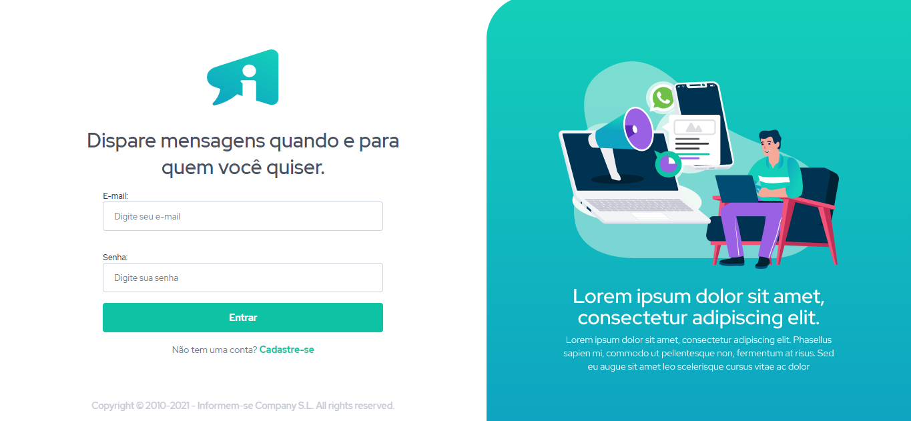
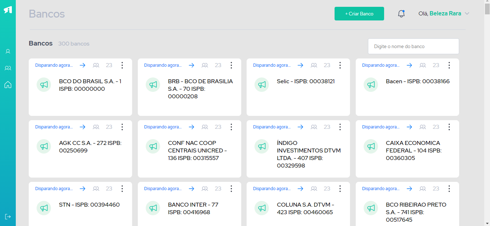
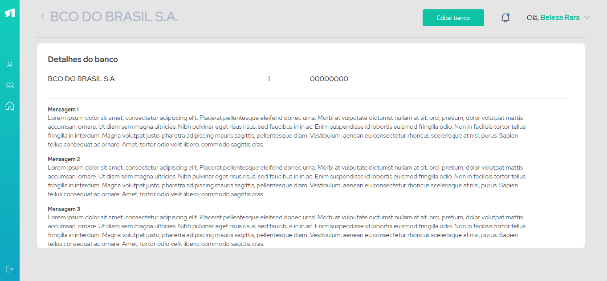

# Iniciar o projeto

Instale as dependências.

### `yarn install`

Roda o app em modo de desenvolvimento.\
Acesse no seu browser [http://localhost:3000](http://localhost:3000) para visualizar.

The page will reload if you make edits.\
You will also see any lint errors in the console.

### `yarn start`

Roda o app em modo de desenvolvimento.\
Acesse no seu browser [http://localhost:3000](http://localhost:3000) para visualizar.

The page will reload if you make edits.\
You will also see any lint errors in the console.

 

 

# Projeto para um teste de vaga e, para praticar.

## Aplicação responsiva, consumindo API da [Brasil API](https://brasilapi.com.br/docs#tag/BANKS)

### Página inicial
 

### Página de lista dos bancos
 

### Página de detalhes dos bancos
 

